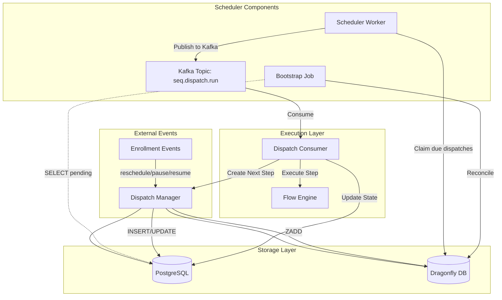

# Sequence Scheduler - High-Scale Distributed System

High-performance sequence scheduler supporting 20M+ dispatches/day with <10s delay using Dragonfly delay queue and Kafka.

## Architecture

### Architecture Overview



### Data Flow

1. **Scheduling**: `Dispatch Manager` creates a `SequenceDispatch` record in **PostgreSQL** and adds the `dispatchId` to **Dragonfly** (ZSET) with the score as `runAtMs`.
2. **Monitoring**: `Scheduler Worker` (bucket-sharded) ticks every 500ms, claiming due items from **Dragonfly** using a Lua script to ensure atomicity.
3. **Dispatching**: Claimed IDs are published to **Kafka** topic `seq.dispatch.run`.
4. **Execution**: `Dispatch Consumer` pulls from Kafka, acquires an optimistic lock in DB, executes the step, and calls `Dispatch Manager` to schedule the next step if available.
5. **Recovery**: `Bootstrap Job` runs periodically to sync any `pending` dispatches from **PostgreSQL** that might be missing in **Dragonfly**.

## Key Features

### Eager Reschedule/Cancel (Approach #1)

- When `nextRunAt` changes: cancel old pending dispatch in DB + remove from Dragonfly
- Create new dispatch with new ID
- No versioned members needed

### Strict Idempotency

- `UNIQUE(idempotencyKey, chatbotId)` constraint
- Key format: `${chatbotId}:${enrollmentId}:${stepId}:${runAtISOString}`
- Prevents duplicates even on retry

### Bucket Sharding (0-255)

- Stable hash: `SHA256(chatbotId:contactId)[0]`
- Horizontal scaling via bucket assignment
- Each worker handles subset of buckets

### Optimistic Locking

- Sender requires `status='pending' → 'running'` transition
- Prevents duplicate execution
- Guards against canceled dispatches

## Database Schema

### SequenceDispatch

```sql
- id TEXT PK
- runAt TIMESTAMP(3)
- runAtMs BIGINT (epoch milliseconds)
- bucket SMALLINT (0-255)
- status TEXT (pending, running, completed, failed, canceled)
- idempotencyKey TEXT
- attempt INT
- lastError TEXT
- lockedAt, lockOwner, completedAt
- chatbotId, sequenceId, contactId, stepId, enrollmentId

UNIQUE(idempotencyKey, chatbotId)
INDEX(bucket, status, runAtMs) WHERE status IN ('pending','running')
```

### SequenceEvent

```sql
- eventType TEXT (dispatch_completed, dispatch_canceled, dispatch_failed_retry, dispatch_failed_final)
- payload JSON
- dispatchId TEXT
- occurredAt TIMESTAMP(3)
```

## Dragonfly Keys

### Schedule ZSET

```
Key: seq:dispatch:schedule:{bucket}
Member: {dispatchId}
Score: {runAtMs}
```

### Retry ZSET

```
Key: seq:dispatch:retry:{bucket}
Member: {dispatchId}
Score: {retryAtMs}
```

### Lock Key

```
Key: seq:dispatch:lock:{dispatchId}
Value: 1
TTL: 30 seconds
```

## Configuration

### Environment Variables

```bash
# Dragonfly
DRAGONFLY_URL=redis://localhost:6380

# Kafka
KAFKA_BROKERS=localhost:9092
KAFKA_CONSUMER_GROUP=sequence-dispatch-consumer

# Scheduler
SCHEDULER_BUCKET_RANGE=0-255  # or "0-63" for sharding
HOSTNAME=worker-1

# Bootstrap
BOOTSTRAP_INTERVAL_MS=3600000  # 1 hour
```

### Docker Services

```bash
# Start all services
docker-compose up -d dragonfly kafka zookeeper

# Check services
docker-compose ps

# View logs
docker-compose logs -f dragonfly kafka
```

## Usage

### Start Services

```typescript
import { getSchedulerWorker } from "./scheduler-worker";
import { getDispatchConsumer } from "./dispatch-consumer";
import { getBootstrapJob } from "./bootstrap-job";
import { initializeDragonfly } from "./lib/dragonfly-client";

async function main() {
  // Initialize Dragonfly
  await initializeDragonfly();

  // Start scheduler worker
  const scheduler = getSchedulerWorker();
  await scheduler.start();

  // Start dispatch consumer
  const consumer = getDispatchConsumer();
  await consumer.start();

  // Start bootstrap job
  const bootstrap = getBootstrapJob();
  await bootstrap.start();
}

main().catch(console.error);
```

### Create Dispatch

```typescript
import { createDispatch } from "./lib/dispatch-manager";
import { getDragonflyClient } from "./lib/dragonfly-client";

const dispatch = await createDispatch({
  chatbotId: "chat_123",
  sequenceId: "seq_456",
  contactId: "contact_789",
  stepId: "step_001",
  enrollmentId: "enroll_abc",
  runAt: new Date(Date.now() + 3600000), // 1 hour from now
});

// Add to Dragonfly schedule
const dragonfly = getDragonflyClient();
await dragonfly.addToSchedule(dispatch.bucket, dispatch.id, dispatch.runAtMs);
```

### Reschedule Enrollment

```typescript
import { rescheduleEnrollment } from "./lib/dispatch-manager";
import { getDragonflyClient } from "./lib/dragonfly-client";

const result = await rescheduleEnrollment({
  enrollmentId: "enroll_abc",
  chatbotId: "chat_123",
  newNextRunAt: new Date(Date.now() + 7200000), // 2 hours
  newStepId: "step_002",
});

const dragonfly = getDragonflyClient();

// Remove old dispatch from Dragonfly
if (result.canceled) {
  await dragonfly.batchRemoveFromAll(result.canceled);
}

// Add new dispatch to schedule
if (result.created) {
  await dragonfly.addToSchedule(
    result.created.bucket,
    result.created.id,
    result.created.runAtMs
  );
}
```

### Pause/Resume Enrollment

```typescript
import { pauseEnrollment, resumeEnrollment } from "./lib/dispatch-manager";
import { getDragonflyClient } from "./lib/dragonfly-client";

// Pause
const canceled = await pauseEnrollment({
  enrollmentId: "enroll_abc",
  chatbotId: "chat_123",
});

const dragonfly = getDragonflyClient();
await dragonfly.batchRemoveFromAll(canceled);

// Resume
const created = await resumeEnrollment({
  enrollmentId: "enroll_abc",
  chatbotId: "chat_123",
  nextRunAt: new Date(),
  nextStepId: "step_001",
});

await dragonfly.addToSchedule(created.bucket, created.id, created.runAtMs);
```

## Monitoring

### Health Checks

```typescript
// Scheduler health
const scheduler = getSchedulerWorker();
const health = await scheduler.getHealth();
console.log(health);
// { running: true, buckets: [0,1,2,...], stats: { 0: { schedule: 100, retry: 5 }, ... } }

// Bootstrap health
const bootstrap = getBootstrapJob();
const bootstrapHealth = await bootstrap.getHealth();
console.log(bootstrapHealth);
// { running: true, lastRun: Date }
```

### Metrics to Monitor

- **Dispatch latency**: Time from `runAt` to actual execution
- **Queue depth**: Count of pending dispatches per bucket
- **Retry rate**: Percentage of dispatches requiring retry
- **Throughput**: Dispatches processed per second
- **Error rate**: Failed dispatches per minute

### Kafka UI

Access at http://localhost:8090 to monitor:

- Topic: `seq.dispatch.run`
- Consumer lag
- Message throughput

### Dragonfly Monitoring

```bash
# Connect to Dragonfly
redis-cli -p 6380

# Check ZSET sizes
ZCARD seq:dispatch:schedule:0
ZCARD seq:dispatch:retry:0

# View upcoming dispatches
ZRANGE seq:dispatch:schedule:0 0 10 WITHSCORES
```

## Scaling

### Horizontal Scaling

Assign different bucket ranges to different workers:

**Worker 1:**

```bash
SCHEDULER_BUCKET_RANGE=0-63
```

**Worker 2:**

```bash
SCHEDULER_BUCKET_RANGE=64-127
```

**Worker 3:**

```bash
SCHEDULER_BUCKET_RANGE=128-191
```

**Worker 4:**

```bash
SCHEDULER_BUCKET_RANGE=192-255
```

### Performance Tuning

**Dragonfly:**

```bash
--maxmemory=8gb
--proactor_threads=8
--cache_mode=true
```

**Kafka:**

```bash
KAFKA_NUM_PARTITIONS=16
KAFKA_REPLICATION_FACTOR=3
```

**Scheduler:**

- Adjust `CLAIM_LIMIT` (default: 100)
- Adjust `TICK_INTERVAL_MS` (default: 500ms)
- Increase worker instances

## Troubleshooting

### Dispatches not executing

1. Check Dragonfly connection
2. Verify Kafka is running
3. Check scheduler worker logs
4. Verify dispatch status in DB

### High latency

1. Check Dragonfly memory usage
2. Increase scheduler tick frequency
3. Add more worker instances
4. Check Kafka consumer lag

### Duplicate executions

- Should not happen due to optimistic locking
- Check logs for `status='pending' → 'running'` failures
- Verify idempotency keys are unique

### Missing dispatches after restart

- Bootstrap job should reconcile within 1 hour
- Manually trigger: `bootstrap.reconcile()`
- Check Dragonfly persistence settings

## Migration

```bash
# Run migration
cd packages/database
pnpm prisma migrate deploy

# Regenerate Prisma client
pnpm prisma generate
```

## Dependencies

```json
{
  "ioredis": "^5.3.2",
  "kafkajs": "^2.2.4"
}
```

Install in worker package:

```bash
cd apps/worker
pnpm add ioredis kafkajs
```
